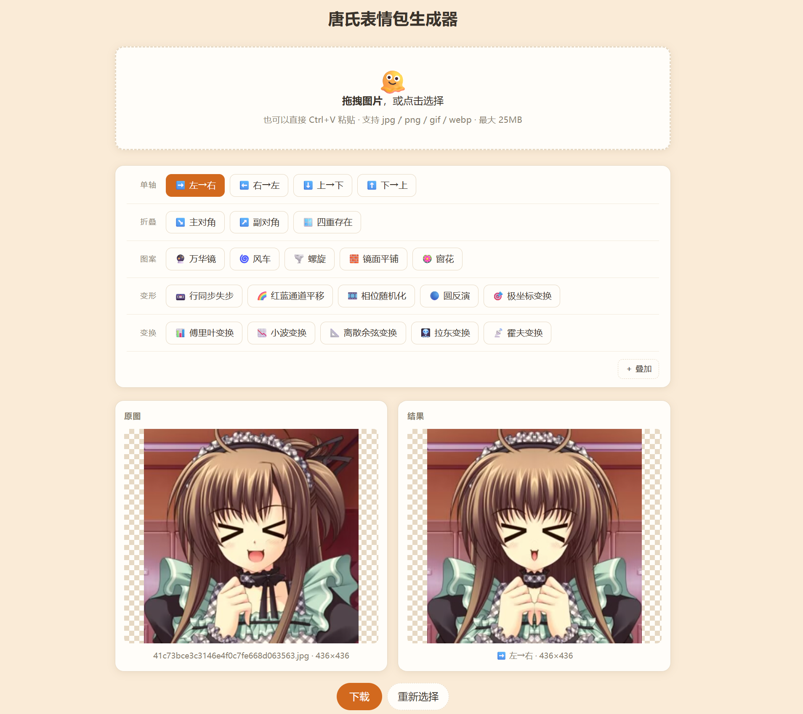

# Emoji-Mirror-Flipper

对称表情包生成器，本机运行的单页 web 应用。



## 快速开始

双击 `run.bat`。

首次运行会自动创建虚拟环境并安装依赖（需要 Python 3.9+），之后每次启动都会自动打开
<http://127.0.0.1:5000/>。关闭控制台窗口或按 `Ctrl+C` 停止。

手动运行：

```bash
pip install -r requirements.txt
python app.py
```

依赖为 Flask、Pillow、numpy。numpy 只有「变换」组的五个效果需要，采用惰性导入，
未安装时其余效果照常工作。

## 输入输出

* 拖拽、点击选择或 `Ctrl+V` 粘贴图片
* 支持 jpg / png / gif / webp，单文件上限 25MB
* 动图逐帧处理，保留原帧间隔与循环次数，透明通道不会变黑
* 原图与结果并排预览，透明区域用棋盘格衬底
* 上传与输出的临时文件超过 6 小时自动清理

## 效果

共 22 种，按性质分为五组。

### 单轴对称

保留一半并镜像到另一半，输出保持原图宽高比。

| 效果 | 原理 |
|---|---|
| ➡️ 左→右 | 保留左半边，镜像到右边 |
| ⬅️ 右→左 | 保留右半边，镜像到左边 |
| ⬇️ 上→下 | 保留上半边，镜像到下边 |
| ⬆️ 下→上 | 保留下半边，镜像到上边 |

### 折叠

| 效果 | 原理 | 输出 |
|---|---|---|
| ↘️ 主对角 | 沿主对角线反射，抗锯齿三角遮罩覆盖一半 | 正方形 |
| ↗️ 副对角 | 沿副对角线反射 | 正方形 |
| 🪟 四重存在 | 左右对称叠加上下对称，四象限全对称 | 原比例 |

### 图案

| 效果 | 原理 | 输出 |
|---|---|---|
| 🔮 万华镜 | 切出 `360/n` 度扇形楔块，沿水平轴镜像成单元，绕中心旋转 `n/2` 次。成品有 n 条过中心的镜像轴，瓣数必须为偶数 | 正方形 |
| 🌀 风车 | 同上但跳过镜像，楔块直接旋转 n 次。只有旋转对称因而带旋向，瓣数可为奇数 | 正方形 |
| 🌪️ 螺旋 | 风车叠加对数扭曲，旋转角随半径递减。扭曲只改角度不改半径，与旋转可交换，n 重旋转对称完整保留 | 正方形 |
| 🧱 镜面平铺 | 缩到 `1/n` 铺 `n×n` 份，相邻格互为镜像使接缝像素相同。完整图案跨 2×2 格成形 | 原比例 |
| 🪷 窗花 | 将中心正方形折到八分之一再展开为 D4 对称纹样（横、竖、两条对角线共四条镜像轴），逐格平铺。仅用到原图的 1/8 | 原比例 |

### 变形

输出仍是一张图像。均保持原比例。

| 效果 | 原理 |
|---|---|
| 📼 行同步失步 | 横向条带环绕滚动，叠加不透明撕裂条，模拟视频行同步丢失 |
| 🌈 红蓝通道平移 | 红蓝通道反向平移，模拟印刷套准误差。alpha 不参与，避免主体边缘发虚 |
| 🎞️ 相位随机化 | FFT 后保留幅度谱、随机化相位。保住纹理统计而摧毁布局，视觉科学中的标准刺激构造法 |
| 🔵 圆反演 | `z → R²/z̄`，半径 R 的圆内外互换，其中每个圆仍是圆 |
| 🎯 极坐标变换 | 横轴映射为角度、纵轴映射为半径，圆盘摊成矩形 |

### 变换

输出是系数空间而非图像。均保持原比例。

| 效果 | 原理 |
|---|---|
| 📊 傅里叶变换 | 对数幅度谱，直流分量移至中心。实数图像满足 `F(-u,-v) = conj(F(u,v))`，故幅度谱关于中心对称 |
| 📉 小波变换 | Haar 分解。每趟将画面替换为相邻两格的平均与差，平均值递归堆入左上角，其余为各尺度边缘细节 |
| 📐 离散余弦变换 | JPEG 的基底。能量集中于左上角而非中心，呈对角脊状纹理 |
| 🩻 拉东变换 | 沿各方向积分，每个角度得到一条投影，堆叠为正弦图。CT 重建的测量量 |
| 📡 霍夫变换 | 每个边缘像素为穿过它的所有直线投票，输出 ρ-θ 累加空间。源图中的直线在此为亮点，点为正弦曲线 |

普通照片的傅里叶谱与 DCT 谱区分度很低，都接近中心一个淡十字；只有条纹、网格这类
强周期结构才会出现明显的规则亮点。

## 参数

| 参数 | 适用 | 说明 |
|---|---|---|
| 瓣数 / 叶数 / 臂数 | 万华镜、风车、螺旋 | n 重对称的 n |
| 起始角 | 万华镜、风车、螺旋 | 0–355 度，决定从源图哪一瓣扇形取样。楔块以外的内容不会出现在结果里 |
| 扭曲 | 螺旋 | 0–720 度 |
| 格数 | 镜面平铺、窗花 | 每条边的格子数。6 格即 `6×6 = 36` 份，不是 6 份 |
| 强度 / 对比 / 层数 / 角度 / 精度 / 半径 / 圈数 | 变形与变换各效果 | 1–5 档 |

## 效果叠加

默认那一行只有一个「＋ 叠加」按钮。点击进入叠加模式后，同一行变为「流程」行，
此时点击效果会追加到末尾而非替换，最多串 4 步。

流程以可点选的 chip 展示：点某一步即编辑该步参数，点 ✕ 移除单步。右端的
「＋ 叠加」此时变为「清空」，清空同时也是退出叠加的方式。两个按钮占据同一位置。

顺序有意义。对角与径向模式会将画面裁成正方形，因此 `万华镜 → 镜面平铺` 与
`镜面平铺 → 万华镜` 结果完全不同。

## 环境变量

| 变量 | 默认 | 说明 |
|---|---|---|
| `EMF_PORT` | `5000` | 端口 |
| `EMF_HOST` | `127.0.0.1` | 监听地址 |
| `EMF_NO_BROWSER` | 未设置 | 设为 `1` 则不自动打开浏览器 |

## 安全

服务默认只监听 `127.0.0.1`，仅本机可访问。不要将 `EMF_HOST` 改为 `0.0.0.0`
暴露到公网：Flask 自带的开发服务器没有鉴权和限流。

## 结构

```
app.py                Flask 路由与 API
mirror.py             核心处理逻辑，可单独作为模块使用
templates/index.html  单页前端
run.bat               启动脚本
uploads/ output/      运行时临时文件，自动清理
```

`mirror.py` 可直接调用：

```python
from pathlib import Path
from mirror import KALEIDO, PINWHEEL, QUAD, SPIRAL, TILE, PAPERCUT, flip, probe

src = Path("target.gif")
info = probe(src)                                  # validates that it really is an image

flip(src, Path("out.gif"), "l2r", info.animated)                 # 单轴镜像
flip(src, Path("diag.gif"), "d1", info.animated)                 # 主对角
flip(src, Path("quad.gif"), QUAD, info.animated)                 # 四重存在
flip(src, Path("tile.gif"), TILE, info.animated, count=3)        # 镜面平铺
flip(src, Path("cut.gif"), PAPERCUT, info.animated, count=3)     # 窗花
flip(src, Path("kal.gif"), KALEIDO, info.animated,               # 万华镜
     count=8, offset=45)
flip(src, Path("pw.gif"), PINWHEEL, info.animated,               # 风车
     count=5, offset=0)
flip(src, Path("sp.gif"), SPIRAL, info.animated,                 # 螺旋
     count=6, offset=0, twist=180)
```

效果链用 `flip_chain()`，步骤按顺序应用：

```python
from mirror import KALEIDO, Step, flip_chain

flip_chain(src, Path("combo.gif"),
           [Step("d1"), Step(KALEIDO, count=6, offset=45)],
           info.animated)
```

## 实现要点

以下几处不是显而易见的，改动相关代码前值得先读。

**径向合成的画布**。万华镜、风车、螺旋在放大 √2 倍的画布上合成后再裁回原尺寸。
从边缘中点方向取的楔块只有 `size/2` 的半径，而输出四角在 `size×0.707` 处，
凡是旋转步长不为 90 度整数倍的瓣数都会把空白转进角落。

**中心裁剪的奇偶性**。裁剪时须保证两侧留白为偶数，否则会偏半个像素，破坏镜像轴。

**窗花的折叠层级**。D4 的基本域是正方形的八分之一，因此必须先把单个象限沿其自身
对角线折叠再镜像展开到四象限。直接对整个正方形做对角折会丢弃一整个三角形，
破坏此前建立的横竖对称。

**坐标变换的取值范围**。螺旋的扭曲在内切圆处衰减到零；圆反演用
`R²/(r + R²/rim)` 平滑有界化。两者都是为了保证采样点始终落在图内，
否则输出会出现大面积透明空洞（圆反演照字面实现时最强档空洞占 39%）。

**DCT 的归一化**。直流分量是所有像素之和，量级碾压其余系数，沿用 min-max
归一化会把画面压成全黑，改为按 99% 分位数归一化。

**随机的可复现性**。行同步失步与相位随机化的种子由参数和帧序号经 `zlib.crc32`
导出，不使用 `hash()`（它在每个进程加盐）。输出缓存以 variant 为键，
同一 variant 重复渲染必须逐字节一致；帧序号参与种子则让动图逐帧变化。

**variant 键**。一次渲染由 variant 唯一标识，同时作为输出文件名和 URL 路径段。
链式用 `-` 连接各步（如 `d1-kaleido_6_45`）。所有模式名与参数均不含连字符，
因此单步键与引入叠加功能之前逐字节相同。`parse_chain()` 统一校验，
非法 variant 一律 404。
